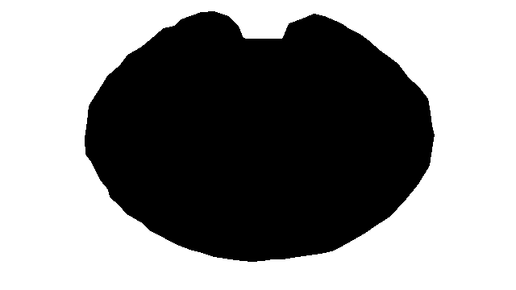

# Beyblade X Arena Tracker

This project is heavily vibe-coded and still in the testing phase.

Real-time tracking system for a Beyblade X arena: detects up to 2 beyblades via webcam, tracks position, radius and velocity, maintains identity across frames, detects collisions, and shows a debug overlay.

### Demo videos

This is the result (still in WIP):


## Requirements

- Python 3.10 or higher
- Webcam (the program uses `cv2.VideoCapture(0)`)

## Installation

1. Clone or enter the project folder:
   ```bash
   cd open_beybladex_ar_core
   ```

2. Create and activate a virtual environment:
   ```bash
   python -m venv .venv
   source .venv/bin/activate   # Linux/macOS
   # .venv\Scripts\activate   # Windows
   ```

3. Install dependencies:
   ```bash
   pip install -r requirements.txt
   ```

## Running

Start the tracker:

```bash
python main.py
```

- **Exit**: press `q` in the webcam window to close.

CLI arguments:

| Flag | Description |
|------|-------------|
| `-v` | Video input |
| `-s` | Save output |
| `-d` | Debug |
| `-e` | Trail/impact effects |
| `-w` | WebSocket for `open_beybladex_ar_web` SFX projection |
| `-a` | Manually select arena ROI |
| `-rm` | Manually select rail mask polygon (click along inner edge of rail) |
| `-rz` | Manually select red zone (high-priority circle: center + edge, saved to `RED_ZONE_POINTS_FILE`) |

### Mask preview tools

Two one-shot scripts capture a frame and save mask images for inspection and tuning.

#### Rail mask

The rail mask zeroes saturation in the green arena border region before Hough detection, so circles are only detected on the white floor and beyblades. The polygon (or auto-built annulus) defines the **excluded** area. Inside the polygon = tracking zone; outside = rail (masked out).



*Rail mask example: white = excluded (green rail); black = tracking area*

- **Define manually** with `-rm`: click 8–12 points along the inner edge of the rail, then `[c]` to confirm. Points saved to `RAIL_MASK_POINTS_FILE`.
- **Preview**:

```bash
python run_rail_mask_snapshot.py
```

  Builds and saves the mask, opens it on Linux/macOS. Output: `output/rail_mask.png` (white = excluded region).
- Config: `RAIL_MASK_SAVE_PATH`, `RAIL_MASK_POINTS_FILE`.

#### Dome mask snapshot

```bash
python run_dome_mask_snapshot.py
```

- Grabs one frame from the camera, builds the dome exclusion mask (glare + optional wedge), and saves it.
- Output: `output/dome_mask.png` (white = excluded) and `output/dome_mask_overlay.png` (frame with excluded regions tinted).
- Masks specular reflections (config: `DOME_GLARE_V_MIN`, `DOME_GLARE_S_MAX`) and optionally the "Beyblade X" text region (config: `DOME_EXCLUDE_WEDGE_ENABLED`, `DOME_EXCLUDE_ANGLE_START`, `DOME_EXCLUDE_ANGLE_END`).
- Opens the mask image on Linux/macOS.
- Config: `DOME_MASK_SAVE_PATH` (default: `output/dome_mask.png`).

During execution you will see:
- Colored circles around detected beyblades (green and blue)
- Highlighted center and velocity arrow
- Label with ID and scalar speed
- **IMPACT!** text at center when the two beyblades touch (center distance < sum of radii)

## Pipeline

```
[Webcam / Video] --> [Frame] --> [Arena Mask (HSV)]
                                        |
                                        v
                              [Hough Circles Detection]
                                        |
                                        v
                              [Identity Assignment]
                              - nearest-neighbour + prediction
                              - reference histograms (re-id)
                              - recovery if stuck at edge
                                        |
                                        v
                              [BeyState: position, velocity, radius]
                                        |
                +-----------------------+-----------------------+
                v                       v                       v
        [Collision Detect]      [Overlay / Effects]      [WebSocket]
        (distance < r1+r2)     (trail, impact flash)    (open_beybladex_ar_web)
```

1. **Input**: webcam (`cv2.VideoCapture(0)`) or video file (`-v path`).
2. **Arena mask**: HSV mask that excludes white floor and green arena border so Hough detects only beyblades.
3. **Hough circles**: circle detection with radii in range `HOUGH_MIN_RADIUS`-`HOUGH_MAX_RADIUS`, scaled with frame size.
4. **Identity assignment**: each circle is assigned to the nearest bey (or predicted position); reference HSV histograms bootstrapped from the first frame and updated on the fly stabilize id0/id1; recovery within `ASSIGN_RECOVERY_FRACTION` if a bey has no circle.
5. **BeyState**: position (smoothed), velocity, scaled radius.
6. **Collision**: distance between centers < r1 + r2.
7. **Output**: overlay circles/arrows, trail and impact flash (`-e`), video save (`-s`), WebSocket for web SFX (`-w`).

## Project Structure

| File / Dir      | Role                                                                 |
|-----------------|----------------------------------------------------------------------|
| `main.py`       | Entry point: argparse, main loop orchestration                       |
| `arena.py`      | Arena ROI setup (manual, config, auto-detect)                        |
| `preprocess.py` | Frame preprocessing (HSV, CLAHE)                                     |
| `roi.py`        | Interactive arena ROI selection UI                                  |
| `overlay/`      | Drawing: debug overlay, effects (trail, impact), main overlay       |
| `web.py`        | WebSocket server, `build_tracking_data`, push to clients            |
| `tracker.py`    | `BeyTracker`: Hough circles, identity, Kalman, bey state            |
| `physics.py`    | Velocity, collision and wall detection                              |
| `utils.py`      | Position smoothing, Euclidean distance                               |
| `config.py`     | Tunable parameters (camera, Hough, smoothing, colors, debug)         |
| `run_rail_mask_snapshot.py` | One-shot: save rail mask for inspection |
| `run_dome_mask_snapshot.py` | One-shot: save dome mask (glare + wedge) for inspection |
| `tests/`        | Unit tests for preprocess, physics, web, utils                      |

Run tests: `pytest tests/ -v`

## Configuration

All tunable parameters are in `config.py`. Use `-d` at runtime to see live detection counts and tracking state.

### Important variables and how they affect tracking

| Variable | Effect of increasing | Effect of decreasing |
|----------|----------------------|------------------------|
| **HOUGH_DETECTION_CHANNEL** | `"saturation"` = HSV S (better for white floor vs colored chips); `"grayscale"` = luminance | |
| **HOUGH_SAT_SCALE** | Boost colored chips vs white floor (1.2-1.5); higher = stronger contrast | Lower = raw saturation |
| **HOUGH_SAT_FLOOR** | Clip values below this to 0; suppress near-white noise (0 = disabled) | |
| **HOUGH_SAT_CLAHE_ENABLED** | Apply CLAHE to S channel for uneven arena lighting | False = no CLAHE on S |
| **HOUGH_PARAM2** | Fewer circle detections, cleaner but may miss blurry beys | More detections, noisier (false circles from edges, glare) |
| **HOUGH_MIN_RADIUS / HOUGH_MAX_RADIUS** | Only larger circles detected | Only smaller circles detected; adjust to match bey size in pixels |
| **HOUGH_MIN_DIST** | Fewer duplicate circles for same bey; may miss when 2 beys are close | More circles, risk of double-tracking one bey |
| **ARENA_ROI** radius (3rd value) | Larger search area; includes stadium perimeter | Smaller area; focuses on white floor only |
| **ARENA_ROI_HIGH** | Red circle, high-priority zone (center) | Set ARENA_ROI_LOW = None for red only |
| **ARENA_ROI_LOW** | Green circle; set to None to disable | |
| **PREFER_HIGH_PRIORITY** | When full, replace edge bey with unmatched center candidate | False = never replace |
| **REJECT_HUE_RANGES** | Add more hue ranges to exclude (e.g. `[(35, 95)]` for green rail) | Fewer exclusions; set `[]` to disable (needed for green beys) |
| **REJECT_NEAR_RIM_FRACTION** | Reject circles in outer X of arena; 0.10 = outer 10% (green rail zone) | 0 = disabled; lower = allow beys nearer rim |
| **RAIL_MASK_ENABLED** | Zero S in green rail region before Hough (stadium is static) | False = no rail mask |
| **RAIL_MASK_POINTS_FILE** | JSON file for polygon points; load when exists, recreate with `-rm` | `output/rail_mask_points.json` |
| **POLYGON_EDGE_MARGIN** | Reject circles within N px of polygon edge (rail reflections); 0 = disabled | 18 |
| **DOME_GLARE_ENABLED** | Zero S in specular spots (plastic dome reflections) before Hough | True |
| **DOME_GLARE_V_MIN** | V above this = potential glare; lower = catch more | 200 |
| **DOME_GLARE_S_MAX** | S below this in bright region = specular; higher = catch more | 55 |
| **DOME_EXCLUDE_WEDGE_ENABLED** | Exclude angular wedge where "Beyblade X" text is (0=top, 90=right, 180=bottom) | False |
| **DEBUG_HIDE_RED_CIRCLE_WHEN_POLYGON** | Cleaner overlay: hide red circle when polygon ROI is used | True |
| **ZERO_VELOCITY_CLEAR_FRAMES** | Drop bey if speed < threshold for N frames (likely wrong object) | 0 = disabled |
| **COLOR_SAT_MIN** | Stricter: only vivid chips accepted | More permissive: paler chips accepted, risk of white glare |
| **COLOR_CENTER_MIN_FILL** | Stricter: more of center must be coloured | More permissive for small chips or motion blur |
| **MATCH_MAX_DISTANCE** | Tracks faster motion; may wrong-match when beys cross | More stable identity; may lose track when bey moves fast |
| **MATCH_IDENTITY_WEIGHT** | Color matters more; less likely to swap bey1/bey2 when they cross | Position dominates; may swap identities when beys cross |
| **IDENTITY_HUE_MAX_DRIFT** | Stricter hue match (set 0 to disable reject) | No hue-based rejection; any hue accepted |
| **IDENTITY_BOOTSTRAP_FRAMES** | More samples to lock identity; more robust to spin/incline | Identity locked from first frame only; may be noisy |
| **MAX_RECOVERY_FRAMES** | Keeps track longer when detection fails briefly | Drops track sooner; useful if tracker sticks to wrong object |
| **KALMAN_MAX_PREDICTION_DRIFT** | Prediction can travel further when Hough misses | Prediction stays closer to last position; better for slow beys |
| **KALMAN_MAX_VELOCITY_PX** | Allow higher extrapolated velocity when lost | Reject prediction and hold; rely on Hough to re-acquire (set 0 to disable) |
| **KALMAN_RIM_CLAMP_FRAC** | When bey is in outer band (dist >= this * radius), remove outward velocity | 0.92 = clamp in outer 8%; 0 = disabled |
| **CIRCULAR_PREDICTION_ENABLED** | Predict along circular arc (orbit) when detectable | Use linear (constant velocity) only |
| **CIRCULAR_HISTORY_LEN** | More positions for circle fit; smoother orbit estimate | Fewer; faster to adapt, less stable fit |
| **KALMAN_LOSS_VELOCITY_DECAY** | Prediction keeps velocity when detection is lost | Prediction slows quickly; better when detections are reliable |
| **BOOTSTRAP_MIN_SPEED** | Bey must move faster to count as "active" | Easier to trigger stuck-clear and rescan |
| **MAX_STUCK_FRAMES** | Waits longer before clearing and rescanning | Clears and rescans sooner when both beys stop |

### Quick fixes

- **Bey1 and bey2 swap when they cross**: Raise `MATCH_IDENTITY_WEIGHT` (e.g. `8`–`12`), set `IDENTITY_HUE_MAX_DRIFT` (e.g. `35`) to reject bad matches, increase `IDENTITY_BOOTSTRAP_FRAMES` (e.g. `15`) for a stable identity.
- **Tracker runs away when bey is briefly lost**: Set `KALMAN_MAX_VELOCITY_PX` (e.g. `60`–`100`) to reject extreme predictions and hold position until Hough re-acquires the circle.
- **Tracking stadium rail instead of beys**: Enable `RAIL_MASK_ENABLED = True` (zeros saturation in green rail), set `REJECT_NEAR_RIM_FRACTION = 0.10`, or add `REJECT_HUE_RANGES = [(35, 95)]` (only if not using green beys).
- **Beys blur and disappear**: Lower `HOUGH_PARAM2` (e.g. `12`–`14`), raise `MATCH_MAX_DISTANCE` and `KALMAN_MAX_PREDICTION_DRIFT`.
- **Tracker locks onto wrong objects**: Enable `RAIL_MASK_ENABLED`, set `ZERO_VELOCITY_CLEAR_FRAMES = 45` (drop stationary tracks), shrink `ARENA_ROI`, lower `MAX_RECOVERY_FRAMES`.
- **Using green Beyblades**: Set `REJECT_HUE_RANGES = []` so green chips are not rejected.

## Web SFX Projection

Sibling project [open_beybladex_ar_web](https://github.com/Trafitto/open-beybladex-ar-web) provides a browser-based SFX output for projection. Run the core with `-w`/`--web` to broadcast tracking data via WebSocket. See the web project's README for setup.


## Early demos

The first demo shows the tracking output with the debug overlay enabled. The second demo shows the same tracker with simple visual effects applied for testing.


The core tracker broadcasts bey position, velocity and collision events to the sibling project `open_beybladex_ar_web` via WebSocket (`-w`). That project renders the SFX overlay and projection in the browser. The video below shows the output captured from the web client.


[See more demo on YouTube](https://www.youtube.com/playlist?list=PLrNs8uiECbXatd9XZKk8QShOT4uTjQlCy)
